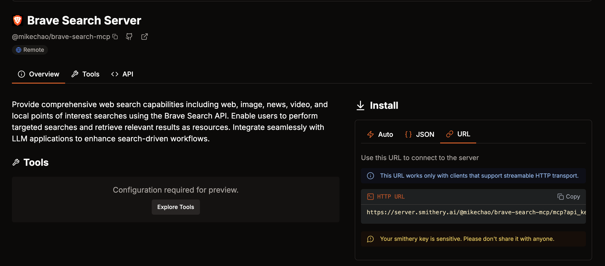

# Tambo Client-side MCP Template

This is a starter NextJS app with tambo-ai for generative UI and Client-sideMCP.

[](https://youtu.be/6zDDPfr7Aoo)

## Get Started

1. Run `npm create-tambo@latest my-tambo-app` for a new project

2. `npm install`

3. `npx tambo init`

- or rename `example.env.local` to `.env.local` and add your tambo API key you can get for free [here](https://tambo.co/dashboard).

4. Run `npm run dev` and go to `localhost:3000` to use the app!

### Configure Client-side Model Context Protocol (MCP) Servers

You can go to https://localhost:3000/mcp-config to add client-sideMCP servers. These servers are stored in browser localStorage and loaded when the application starts.

For the demo above we used smithery.ai's [brave-search-mcp](https://smithery.ai/server/@mikechao/brave-search-mcp)



You can use any MCP compatible server that supports SSE or HTTP, but we do not support any server that requires OAuth. For authentication, you can pass custom HTTP headers to the MCP server configuration, or configure server-side authentication at https://tambo.co/dashboard.

Our MCP config page is built using the `@tambo-ai/react/mcp` package:

```tsx
// In your chat page
<TamboProvider
  apiKey={process.env.NEXT_PUBLIC_TAMBO_API_KEY!}
  components={components}
>
  <TamboMcpProvider mcpServers={mcpServers}>
    <MessageThreadFull contextKey="tambo-template" />
  </TamboMcpProvider>
</TamboProvider>
```

MCP servers in this example are stored in browser localStorage and loaded on application start. Alternatively, you can store them in a database or fetch them from an API.

For more detailed documentation, visit [Tambo's official docs](https://tambo.co/docs).

## Pro Plan with Autumn.js

This app includes a Pro plan system powered by Autumn.js for billing and usage tracking. Users can upgrade to Pro for unlimited story generation.

### Setup Autumn.js

1. **Install Autumn.js:**
   ```bash
   npm install autumn-js
   ```

2. **Configure Environment Variables:**
   Add the following to your `.env.local`:
   ```
   NEXT_PUBLIC_AUTUMN_BACKEND_URL=http://localhost:3000
   AUTUMN_API_KEY=your-autumn-api-key-here
   ```

3. **Set up Autumn Dashboard:**
   - Go to [Autumn Dashboard](https://dashboard.autumn.com)
   - Create a new project
   - Add your Stripe test secret key (`sk_test_...`)
   - Configure the "pro" product with unlimited story generation

4. **Configure Features:**
   In the Autumn dashboard, set up a feature called "story_generation":
   - Free plan: 5 stories per month
   - Pro plan: Unlimited stories

### How it Works

- **Free Plan:** Users get 5 story generations per month
- **Pro Plan:** Users get unlimited story generations
- **Usage Tracking:** Each story generation is tracked via the `/api/track-usage` endpoint
- **Upgrade Flow:** Users can upgrade to Pro via Stripe checkout

The Pro Plan component is integrated into the right sidebar and shows:
- Current plan status (Free/Pro)
- Remaining story count
- Upgrade button for free users
- Usage tracking for each story generation

## Customizing

### Change what components tambo can control

You can see how the `Graph` component is registered with tambo in `src/lib/tambo.ts`:

```tsx
const components: TamboComponent[] = [
  {
    name: "Graph",
    description:
      "A component that renders various types of charts (bar, line, pie) using Recharts. Supports customizable data visualization with labels, datasets, and styling options.",
    component: Graph,
    propsSchema: graphSchema, // zod schema for the component props
  },
  // Add more components
];
```

You can find more information about the options [here](https://tambo.co/docs/concepts/registering-components)
